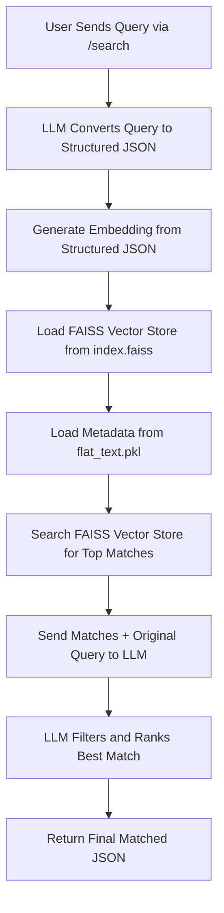

```mermaid
%% XML Embedder App Flow
flowchart TD
    A[User Sends XML via /embed] --> B[Parse XML to Structured JSON]
    B --> C[Generate Embedding using AzureOpenAI]
    C --> D[Store Embedding in FAISS Vector Store File (e.g., index.faiss)]
    D --> E[Store Structured JSON as Metadata in flat_text.pkl]
```


