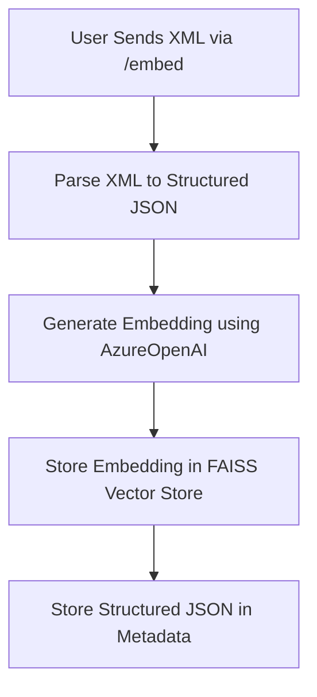
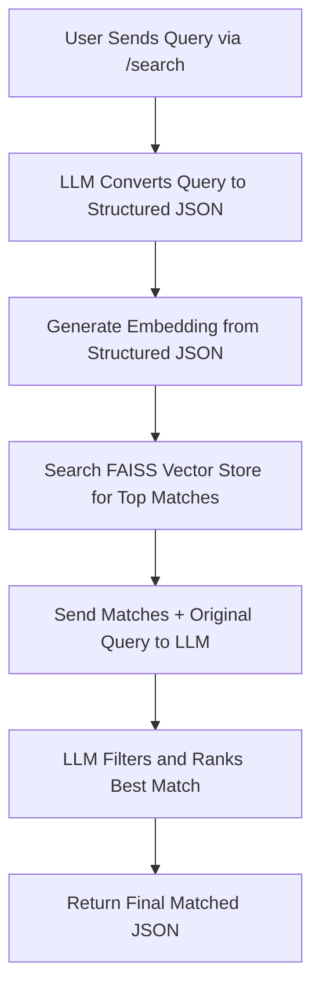

```mermaid
%% XML Embedder App Flow
flowchart TD
    A[User Sends XML via /embed] --> B[Parse XML to Structured JSON]
    B --> C[Generate Embedding using AzureOpenAI]
    C --> D[Store Embedding in FAISS Vector Store]
    D --> E[Store Structured JSON in Metadata]
```

```mermaid
%% XML Search App Flow
flowchart TD
    A[User Sends Query via /search] --> B[LLM Converts Query to Structured JSON]
    B --> C[Generate Embedding from Structured JSON]
    C --> D[Search FAISS Vector Store for Top Matches]
    D --> E[Send Matches + Original Query to LLM]
    E --> F[LLM Filters and Ranks Best Match]
    F --> G[Return Final Matched JSON]
```
