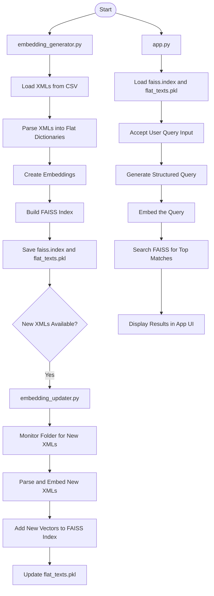

```mermaid
flowchart TD
    A([Start]) --> B[embedding_generator.py]
    A --> E[app.py]

    %% Embedding Generation Flow
    B --> B1[Load XMLs from CSV]
    B1 --> B2[Parse XMLs into Flat Dictionaries]
    B2 --> B3[Create Embeddings]
    B3 --> B4[Build FAISS Index]
    B4 --> B5[Save faiss.index and flat_texts.pkl]

    B5 --> C{New XMLs Available?}
    C -- Yes --> D[embedding_updater.py]

    D --> D1[Monitor Folder for New XMLs]
    D1 --> D2[Parse and Embed New XMLs]
    D2 --> D3[Add New Vectors to FAISS Index]
    D3 --> D4[Update flat_texts.pkl]

    %% Search Flow
    E --> E1[Load faiss.index and flat_texts.pkl]
    E1 --> E2[Accept User Query Input]
    E2 --> E3[Generate Structured Query]
    E3 --> E4[Embed the Query]
    E4 --> E5[Search FAISS for Top Matches]
    E5 --> E6[Display Results in App UI]
```
